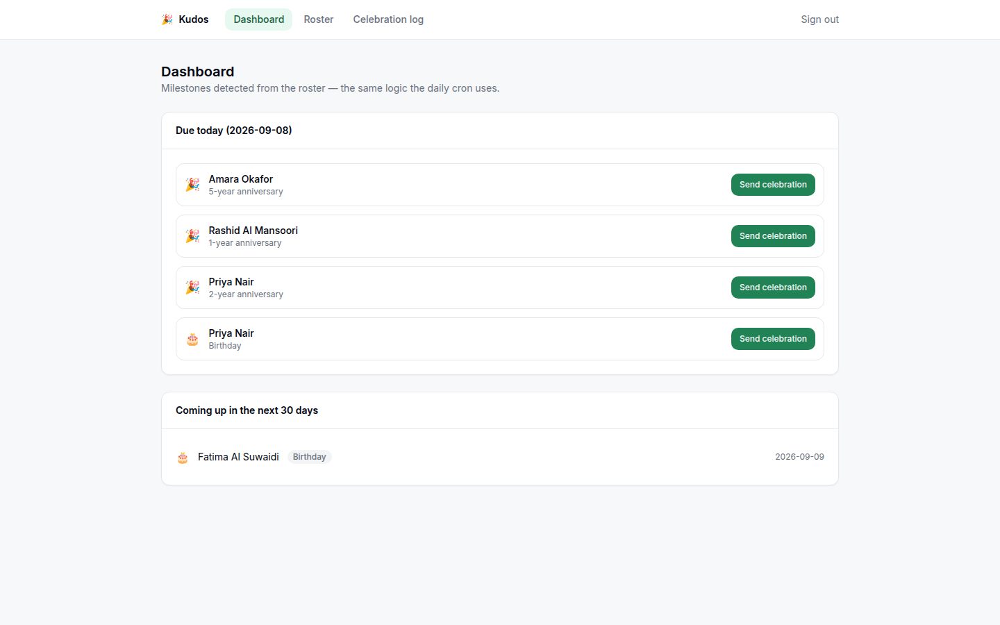
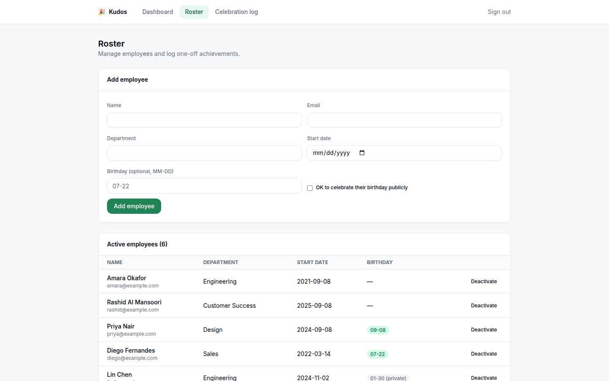
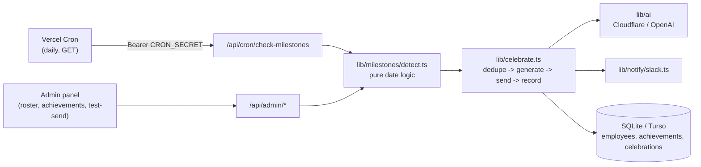

<h1 align="center">🎉 Kudos — Employee Appreciation Bot</h1>

<p align="center">
  Detects work anniversaries, birthdays, and logged achievements automatically,
  then posts AI-generated celebration messages to Slack on a daily schedule.
</p>

<p align="center">
  <a href="https://github.com/ubaidslab/automated-employee-appreciation-milestone-bot/actions/workflows/ci.yml"></a>
  
  
  
</p>

---

## Contents

- [What this is](#what-this-is)
- [Screenshots](#screenshots)
- [Features](#features)
- [Architecture](#architecture)
- [Tech stack](#tech-stack)
- [Getting started](#getting-started)
- [Configuration](#configuration)
- [Scheduling in production](#scheduling-in-production)
- [Testing & CI](#testing--ci)
- [Project structure](#project-structure)
- [Security & privacy notes](#security--privacy-notes)
- [Roadmap](#roadmap)
- [License](#license)

## What this is

Real teams buy products like Bonusly or Nectar to do exactly this: notice when someone hits a
work anniversary, has a birthday, or ships something worth celebrating, and say so publicly
before it gets forgotten in the day-to-day. This is a lightweight, self-hostable version of
that idea — a daily job that checks a roster against a set of milestone rules, writes a short,
specific (not generic) message with an LLM, and posts it to Slack, plus an admin panel to manage
the roster and see exactly what went out and when.

## Screenshots

| Dashboard — today's milestones, detected live from the seed data | Roster management |
|---|---|
|  |  |

(There's a third page, the celebration log, showing send history with AI-generated-vs-fallback
and delivery status per message — described in [Features](#features) below.)

## Features

- **Configurable milestone years** — celebrates anniversaries at 1, 2, 3, 5, 10, 15, 20, 25, 30
  years by default, not every single year. A message every year for every employee is noise
  that kills adoption of tools like this in real teams.
- **Opt-in birthdays** — birthdays are only celebrated for employees explicitly flagged
  `shareBirthday: true`. Not everyone wants that public, and the app doesn't assume otherwise.
- **Achievement logging** — a simple form to log a one-off win ("shipped the redesign," "closed
  the quarter's biggest deal"), which is celebrated immediately, not on the next cron run.
- **AI-generated messages with a safe fallback** — an LLM writes a short, specific message per
  milestone; if the AI provider is down or unconfigured, a simple templated message still goes
  out rather than silently failing to celebrate someone. The admin log shows which happened.
- **Database-level dedup** — a unique index on `(employee, milestone)` is what actually prevents
  a milestone from being celebrated twice, not just application logic — see
  [Security & privacy notes](#security--privacy-notes).
- **Pluggable notification channel** — Slack is the only implementation today, behind a
  `Notifier` interface designed so Teams or email is a new class, not a rewrite.
- **Pluggable AI provider** — the same `AI_PROVIDER` convention as this project's sibling
  [AI Customer Support Agent](https://github.com/ubaidslab/AI-Customer-Support-Agent-):
  Cloudflare Workers AI by default (free tier), OpenAI as a drop-in alternative.
- **Tested date logic** — anniversary/birthday detection (leap years, "already celebrated this
  year," month/day boundaries) is pure, unit-tested logic, not buried inside a route handler.

## Architecture



`lib/celebrate.ts` is the one place that knows how to dedupe, generate a message, send it, and
record the outcome — both the daily cron and the "log an achievement" / "send test celebration"
admin actions call through it, so they can't drift out of sync with each other.

## Tech stack

| Layer | Choice |
|---|---|
| Framework | Next.js 14 (App Router) |
| Language | TypeScript (strict) |
| Styling | Tailwind CSS |
| Database | SQLite (local dev) via Drizzle ORM — swap to Turso for production with one env var |
| AI providers | Cloudflare Workers AI (default), OpenAI-compatible (optional) |
| Notifications | Slack Incoming Webhooks |
| Scheduling | Vercel Cron |
| Testing | Vitest |
| CI | GitHub Actions (lint/typecheck/test/build) |

## Getting started

**Prerequisites:** Node.js 18.18+ (Node 22 recommended), npm.

```bash
git clone https://github.com/ubaidslab/automated-employee-appreciation-milestone-bot.git
cd automated-employee-appreciation-milestone-bot
npm install
cp .env.example .env.local   # fill in ADMIN_KEY and SESSION_SECRET at minimum — see below
npm run db:seed              # creates local.db and seeds realistic fake employees
npm run dev
```

Open [http://localhost:3000](http://localhost:3000) — it redirects to `/login`. Sign in with the
`ADMIN_KEY` you set, then open the Dashboard: the seed data always includes an anniversary and a
birthday due *today*, whatever day you actually run it, so there's something to click "Send
celebration" on immediately. Slack delivery needs `SLACK_WEBHOOK_URL`; without it, the admin
panel and roster/achievement logging all still work — only the final Slack send will error, and
that error is exactly what gets shown in the celebration log's status.

## Configuration

See [`.env.example`](./.env.example) for the full, commented list. Nothing is hardcoded —
every account ID, key, and webhook URL is read from the environment at request time.

| Variable | Required | Purpose |
|---|---|---|
| `DATABASE_URL` | no (default `file:./local.db`) | SQLite locally, `libsql://...` for Turso in production |
| `ADMIN_KEY`, `SESSION_SECRET` | yes | Admin panel login and session signing |
| `CRON_SECRET` | yes (for production scheduling) | Authenticates Vercel's daily trigger |
| `SLACK_WEBHOOK_URL` | for real delivery | [Create one here](https://api.slack.com/messaging/webhooks) |
| `AI_PROVIDER` | no (default `cloudflare`) | `cloudflare` or `openai` |
| `CLOUDFLARE_ACCOUNT_ID`, `CLOUDFLARE_API_KEY` | if using Cloudflare | [Free tier](https://developers.cloudflare.com/workers-ai/) |
| `OPENAI_API_KEY` | if using OpenAI | — |
| `COMPANY_NAME`, `MESSAGE_TONE` | no | Personalize the generated messages |

## Scheduling in production

[`vercel.json`](./vercel.json) defines a daily cron hitting `/api/cron/check-milestones` at
09:00 UTC — adjust the schedule to your team's timezone/working hours. Vercel automatically
sends `Authorization: Bearer $CRON_SECRET` to routes it triggers when `CRON_SECRET` is set as a
project env var, which is exactly what the route checks. To trigger it manually (e.g. while
developing, or to test Slack delivery without waiting for a real day to roll over):

```bash
curl -H "Authorization: Bearer $CRON_SECRET" http://localhost:3000/api/cron/check-milestones
```

## Testing & CI

```bash
npm run lint       # ESLint
npm run typecheck  # tsc --noEmit
npm test           # Vitest — milestone date logic, input validation, admin auth
npm run build       # production build
```

All four run in CI on every push and pull request to `main`.

## Project structure

```
app/
  admin/                    # dashboard, roster, celebration log (client-rendered)
  login/                    # admin key entry
  api/
    cron/check-milestones/  # daily trigger (Vercel Cron, GET, CRON_SECRET-gated)
    admin/                  # employees, achievements, upcoming, celebrations, auth
lib/
  milestones/detect.ts      # pure date logic — anniversary/birthday detection
  celebrate.ts              # dedupe -> generate -> send -> record, shared by cron + admin
  ai/                       # Cloudflare/OpenAI message generation
  notify/slack.ts           # Notifier interface + Slack implementation
  auth/admin-auth.ts        # shared-key login, HMAC-signed session cookies
  validate/                 # input validation for employees and achievements
  db/                       # Drizzle schema, client, migrate, seed
docs/screenshots/           # README images
```

## Security & privacy notes

- **Birthdays are stored as MM-DD, not a full date** — the app never needs birth *year* to
  detect "is today their birthday," so it doesn't collect it. Data minimization, not an
  oversight.
- **Admin auth is demo-grade on purpose**: one shared key (`ADMIN_KEY`), not per-user accounts —
  there's exactly one "admin" role here, not a multi-tenant org model. Session cookies are
  HMAC-signed and expire after 12 hours, but this is not a substitute for real auth (SSO,
  per-user roles) in an actual multi-admin deployment.
- **Double-send protection is enforced at the database level**, not just in application code: a
  unique index on `(employee_id, milestone_key)` means even a race between two overlapping
  requests can produce at most one successful send — the loser gets a clean
  "already_celebrated" result instead of a duplicate Slack message.
- **The Slack webhook URL never reaches the client** — it's read from `process.env` inside a
  server-only route, same as every other credential in this project.
- **Timezone handling is simplified**: all dates are compared as UTC calendar dates, not
  per-employee local time. With one daily cron run and a distributed team, exact per-timezone
  "today" isn't worth the complexity here — documented rather than silently wrong.
- **Seed data is entirely fictional.** Do not point this at a real HR system or real employee
  records without adding proper authentication, access controls, and a data-handling review
  first — this project's auth model was not built for that.
- **Known upstream advisories:** `npm audit` reports high-severity issues that only resolve by
  moving from Next.js 14 to Next.js 16 (which also requires a React 19 + ESLint 9 migration, not
  a patch bump). This app doesn't use the specific features those advisories target (`next/image`
  remote patterns, Server Actions, middleware rewrites beyond the simple auth check in
  `middleware.ts`), so exposure is low, but the honest status is "outstanding, tracked, mitigated
  by non-use," not "clean." The safe patch that *was* a drop-in (Next.js 14.2.35) is applied.

## Roadmap

- [ ] Microsoft Teams and email as additional `Notifier` implementations.
- [ ] Real multi-user admin accounts (this currently has exactly one admin role).
- [ ] Per-employee timezone-aware milestone detection.
- [ ] CSV import for bulk-adding an existing roster.
- [ ] End-to-end tests (Playwright) alongside the existing unit tests.

## License

MIT — see [LICENSE](./LICENSE).

---

Built by [@ubaidslab](https://github.com/ubaidslab).
